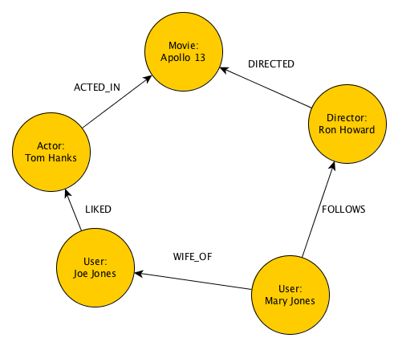

# Graffiti

Graffiti is a headless (no UI) Java CMS which is designed to be dead simple. 

# Weapons of Choice

Java 1.8
Spring Boot
GraphQL-Java
PostgreSQL


# Concepts

Graffiti relies on a handful of core data structures: 

## Graph

A Graph is actually an extermely simple yet powerful data structure:



It is composed of only two basic units:

### Node

A Node (the round elements in the Graph above) is the basic unit of data. Another word for it could be Object or an Entity but we like Node better because this is how they like to call it in the Graph world.

Nodes are composed of key-value pairs.

Nodes are grouped by a type which is just a simple String.

Almost anything can be modelled as a Node: people, cars, invoices, transactions, movies, app pages etc.  

### Edge

An edge represents a link between two nodes. 

Again, this could be called a Link or a Connection but we like to stick to the fancy mathematical jargon.

Edges also have a type they can also have key-value pairs associated with them.

### That's it!

And between these basic primitive data structures you can represent just about anything.

# Getting Started

## Installation

1. Install PostgreSQL

If you have Docker and you want to spin one up easily run:

```
docker run --name postgres -e POSTGRES_DB=graffiti -e POSTGRES_USER=postgres -e POSTGRES_PASSWORD=password -d -p 5432:5432 postgres:9.6.5-alpine
```

2. Initialize the database:

mvn clean spring-boot:run -Dspring.datasource.initialize=true